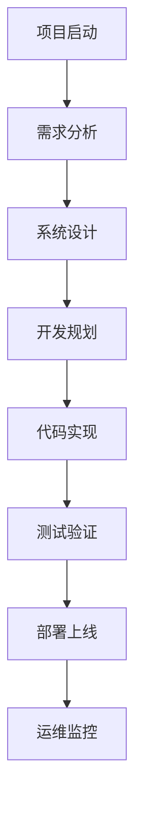

# CrewAI 软件开发全流程管理系统 - 使用指南

## 📖 目录

1. [快速开始](#快速开始)
2. [系统概述](#系统概述)
3. [智能体介绍](#智能体介绍)
4. [工作流程](#工作流程)
5. [使用示例](#使用示例)
6. [高级功能](#高级功能)
7. [常见问题](#常见问题)
8. [最佳实践](#最佳实践)

## 🚀 快速开始

### 环境准备

1. **Python环境**：确保Python版本 >= 3.11
2. **API密钥**：获取Google Gemini API密钥
3. **依赖安装**：运行 `pip install -e .`

### 配置API密钥

```bash
# Windows
set GOOGLE_API_KEY=your-api-key-here

# Linux/Mac
export GOOGLE_API_KEY='your-api-key-here'
```

### 运行系统

```bash
python main.py
```

## 🎯 系统概述

CrewAI软件开发全流程管理系统是一个基于AI智能体的项目管理工具，能够协助完成从需求分析到部署的完整软件开发流程。

### 核心特性

- **智能化协作**：6个专业AI智能体协同工作
- **全流程覆盖**：从项目启动到部署运维的完整流程
- **灵活配置**：支持自定义工作流和智能体配置
- **多种模式**：演示模式、交互模式、自定义模式

## 🤖 智能体介绍

### 1. 项目经理 (Project Manager)
- **职责**：项目整体协调、进度管理、风险控制
- **输出**：项目计划、状态报告、风险评估
- **特长**：项目规划、团队协调、沟通管理

### 2. 需求分析师 (Requirements Analyst)
- **职责**：需求收集、分析、文档编写
- **输出**：需求规格说明书、用户故事、验收标准
- **特长**：业务分析、用户研究、需求建模

### 3. 系统架构师 (System Architect)
- **职责**：系统架构设计、技术选型、性能规划
- **输出**：架构设计文档、技术方案、API规范
- **特长**：架构设计、技术评估、性能优化

### 4. 开发工程师 (Developer)
- **职责**：代码实现、开发规划、代码审查
- **输出**：开发计划、代码实现、技术文档
- **特长**：编程开发、代码优化、技术实现

### 5. 测试工程师 (Test Engineer)
- **职责**：测试规划、用例设计、质量保证
- **输出**：测试计划、测试用例、测试报告
- **特长**：测试设计、质量控制、缺陷管理

### 6. DevOps工程师 (DevOps Engineer)
- **职责**：部署规划、CI/CD设计、运维监控
- **输出**：部署方案、CI/CD配置、运维手册
- **特长**：自动化部署、容器化、监控运维

## 📋 工作流程

### 标准开发流程



### 各阶段详细说明

#### 1. 项目启动阶段
- 项目背景分析
- 目标和范围定义
- 干系人识别
- 风险初步评估

#### 2. 需求分析阶段
- 功能需求收集
- 非功能需求分析
- 用户故事编写
- 验收标准定义

#### 3. 系统设计阶段
- 架构设计
- 技术选型
- 数据库设计
- API接口设计

#### 4. 开发阶段
- 开发计划制定
- 代码实现
- 单元测试
- 代码审查

#### 5. 测试阶段
- 测试计划制定
- 测试用例设计
- 测试执行
- 缺陷管理

#### 6. 部署阶段
- 部署方案设计
- CI/CD配置
- 生产环境部署
- 监控配置

## 💡 使用示例

### 示例1：运行演示项目

```python
# 启动主程序
python main.py

# 选择选项1：运行演示项目
# 系统将自动执行个人博客系统的需求分析
```

### 示例2：交互式模式

```python
# 启动主程序
python main.py

# 选择选项2：交互式模式
# 输入项目描述：开发一个电商网站
# 选择执行阶段：2（需求分析）
```

### 示例3：使用完整工作流示例

```python
# 运行完整工作流示例
python examples/complete_workflow_example.py

# 选择运行模式：1（完整工作流）
```

### 示例4：自定义工作流

```python
from langchain_google_genai import ChatGoogleGenerativeAI
from workflows import create_software_development_workflow

# 创建模型
llm = ChatGoogleGenerativeAI(
    model="gemini-pro",
    temperature=0.7,
    google_api_key="your-api-key"
)

# 创建工作流
workflow = create_software_development_workflow(llm)

# 执行特定阶段
requirements_crew = workflow.create_requirements_analysis_crew(
    project_description="你的项目描述"
)
result = requirements_crew.kickoff()
print(result)
```

## 🔧 高级功能

### 自定义智能体配置

```python
from agents import create_requirements_analyst_with_tools
from config import config

# 使用自定义工具创建智能体
custom_tools = [...]  # 你的自定义工具
analyst = create_requirements_analyst_with_tools(llm, custom_tools)
```

### 配置系统参数

```python
from config import Config

# 修改默认配置
Config.DEFAULT_TEMPERATURE = 0.5
Config.AGENT_CONFIG['max_iter'] = 5
```

### 批量处理项目

```python
projects = [
    "项目1描述",
    "项目2描述",
    "项目3描述"
]

for project in projects:
    crew = workflow.create_requirements_analysis_crew(project)
    result = crew.kickoff()
    # 保存结果
```

## ❓ 常见问题

### Q1: API密钥配置问题
**问题**：提示未设置GOOGLE_API_KEY环境变量

**解决方案**：
```bash
# 临时设置（当前会话有效）
export GOOGLE_API_KEY='your-api-key'

# 永久设置（添加到.bashrc或.zshrc）
echo 'export GOOGLE_API_KEY="your-api-key"' >> ~/.bashrc
source ~/.bashrc
```

### Q2: Python版本兼容性问题
**问题**：运行时出现语法错误

**解决方案**：
- 确保Python版本 >= 3.11
- 使用`python --version`检查版本
- 如需要，使用pyenv或conda管理Python版本

### Q3: 依赖安装问题
**问题**：缺少某些依赖包

**解决方案**：
```bash
# 重新安装依赖
pip install -e .

# 或者手动安装
pip install crewai langchain-google-genai
```

### Q4: 执行速度慢
**问题**：智能体执行任务时间过长

**解决方案**：
- 调整temperature参数（降低创造性）
- 减少max_iter参数
- 简化任务描述

### Q5: 输出质量不理想
**问题**：智能体输出不符合预期

**解决方案**：
- 提供更详细的项目描述
- 调整智能体的backstory
- 修改expected_output描述

## 📚 最佳实践

### 1. 项目描述编写

**好的项目描述应该包含：**
- 明确的业务目标
- 详细的功能需求
- 技术栈偏好
- 约束条件和限制
- 用户群体描述

**示例：**
```
开发一个在线教育平台，主要服务于K-12学生和教师。

核心功能：
1. 用户管理（学生、教师、管理员）
2. 课程管理和发布
3. 在线直播教学
4. 作业布置和批改
5. 学习进度跟踪
6. 支付和订阅管理

技术要求：
- 前端：React.js，支持移动端
- 后端：Node.js + Express
- 数据库：MongoDB
- 实时通信：WebRTC
- 部署：AWS云平台

约束条件：
- 支持1000+并发用户
- 99.9%可用性要求
- 符合教育行业数据保护规范
```

### 2. 阶段性执行策略

**建议按以下顺序执行：**
1. 先运行需求分析，获得详细需求
2. 基于需求结果执行系统设计
3. 根据设计结果进行开发规划
4. 并行执行测试规划和部署规划

### 3. 结果优化技巧

**提高输出质量：**
- 使用具体的业务场景描述
- 提供参考案例或竞品分析
- 明确技术偏好和约束
- 设置合理的项目规模预期

### 4. 团队协作建议

**多人使用时：**
- 建立统一的项目描述模板
- 定期同步各阶段输出结果
- 建立代码和文档版本管理
- 设置定期的进度检查点

### 5. 持续改进

**系统优化：**
- 收集和分析输出质量反馈
- 根据项目类型调整智能体配置
- 建立项目模板库
- 定期更新最佳实践文档

---

## 📞 支持与反馈

如果您在使用过程中遇到问题或有改进建议，请：

1. 查看本使用指南和FAQ
2. 检查GitHub Issues
3. 提交新的Issue或Pull Request
4. 联系开发团队

**祝您使用愉快！** 🎉